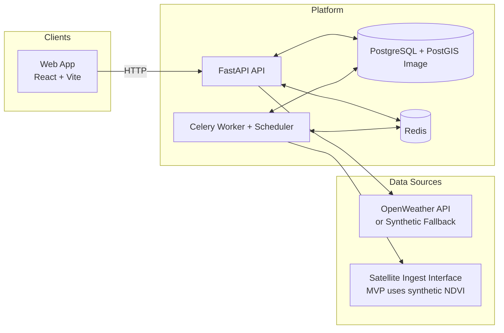
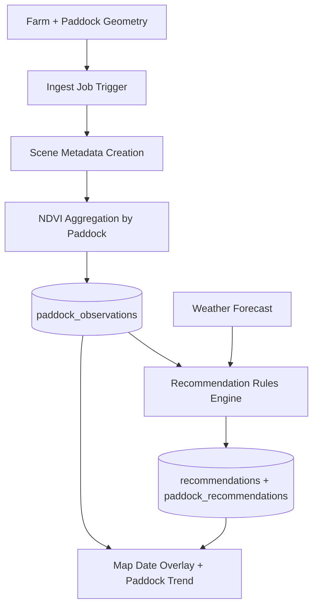

# TERRA


TERRA is a map-first farm intelligence platform for paddock monitoring. It combines a FastAPI backend, Celery worker pipeline, and React frontend to compute paddock-level NDVI signals, attach weather context, and generate simple weekly recommendations.

Current implementation status: **dev-facing MVP** (no auth/login yet).

## Table of Contents

- [Architecture](#architecture)
- [Data Flow](#data-flow)
- [Core Capabilities](#core-capabilities)
- [Getting Started](#getting-started)
- [Local Development](#local-development)
- [API Overview](#api-overview)
- [Operations and Reliability](#operations-and-reliability)
- [Repository Layout](#repository-layout)
- [Documentation](#documentation)
- [Roadmap Notes](#roadmap-notes)

## Architecture



## Data Flow



## Core Capabilities

- Create and manage farms and paddocks.
- Import paddocks via GeoJSON FeatureCollection.
- Compute/serve paddock NDVI observations per date (currently deterministic synthetic values).
- Show NDVI bucket overlays and per-paddock trend series in the map UI.
- Fetch and display 7-day weather forecast.
- Generate weekly rule-based recommendations (`GRAZE_NOW`, `AVOID_WATERLOG`, `MONITOR_STRESS`, `LOW_DATA`).
- Track pipeline execution via `job_runs`.

## Getting Started

### Prerequisites

- Docker and Docker Compose
- Python 3.12+ (for running API directly)
- Node.js 20+ (for running frontend directly)

### Quickstart (Full Stack via Docker)

```bash
cd infra
docker compose up --build
```

Services started:

- `web` at `http://localhost:5173`
- `api` at `http://localhost:8000` (base API prefix: `/api/v1`)
- `postgres` on `localhost:5432`
- `redis` on `localhost:6379`
- `worker` + `scheduler` for background jobs

Optional environment variables:

- `OPENWEATHER_API_KEY` for live weather forecast calls.
- `VITE_MAPBOX_TOKEN` for interactive map rendering.

Without these keys:

- Weather falls back to synthetic data.
- Map view shows a graceful fallback panel.

## Local Development

### 1) Start dependencies (db + redis)

```bash
cd infra
docker compose up -d postgres redis
```

### 2) Run API

```bash
cd api
python -m venv .venv
source .venv/bin/activate
pip install -r requirements.txt
uvicorn app.main:app --reload --host 0.0.0.0 --port 8000
```

### 3) Run worker

```bash
cd api
source .venv/bin/activate
celery -A app.workers.celery_app.celery_app worker --loglevel=info
```

### 4) Run scheduler

```bash
cd api
source .venv/bin/activate
celery -A app.workers.celery_app.celery_app beat --loglevel=info
```

### 5) Run frontend

```bash
cd web
npm install
npm run dev
```

### 6) Run tests

```bash
cd api
PYTHONPATH=. pytest -q
```

## API Overview

Interactive docs: `http://localhost:8000/docs`

Base prefix: `/api/v1`

Core endpoints:

- `GET /health` - health check.
- `GET /farms` - list farms.
- `POST /farms` - create farm.
- `GET /farms/{farm_id}/paddocks` - paddock list.
- `POST /farms/{farm_id}/paddocks` - create paddock.
- `POST /farms/{farm_id}/paddocks/import` - bulk import paddocks from GeoJSON FeatureCollection.
- `GET /farms/{farm_id}/observations/dates` - available observation dates.
- `GET /farms/{farm_id}/observations?date=YYYY-MM-DD` - paddock metrics for date.
- `GET /paddocks/{paddock_id}/observations` - paddock time series.
- `GET /farms/{farm_id}/weather/forecast` - 7-day weather.
- `GET /farms/{farm_id}/recommendations/latest` - latest recommendation set.
- `POST /farms/{farm_id}/recommendations/generate` - on-demand recommendation generation.
- `POST /farms/{farm_id}/jobs/ingest` - run ingest + weather + recommendation pipeline.
- `GET /jobs/runs` - pipeline run history.

## Operations and Reliability

- Environment templates:
  - `api/.env.example`
  - `web/.env.example`
- Runtime stack definition: `infra/docker-compose.yml`
- Seed behavior:
  - Demo farm and 3 paddocks auto-seeded on first startup.
  - Default recommendation thresholds seeded in DB.
- Reliability controls:
  - Idempotent scene + observation upsert patterns.
  - Job run tracking with status/stats/error fields.
- Current constraints:
  - No auth/tenant isolation yet (intentional for dev-facing MVP).
  - Satellite NDVI is synthetic until real free STAC ingest is wired.

## Repository Layout

```text
api/         FastAPI app, SQLAlchemy models, services, Celery tasks, tests
web/         React + Vite frontend
infra/       Docker Compose stack for local runtime
docs/        Setup, API, deployment, security, operations docs
```

## Documentation

- [Documentation Index](./docs/README.md)
- [Setup Guide](./docs/SETUP.md)
- [Deployment Guide](./docs/DEPLOYMENT.md)
- [Security Guide](./docs/SECURITY.md)
- [API Documentation](./docs/api/README.md)
- [Operations Runbook](./docs/operations/RUNBOOK.md)

## Roadmap Notes

- Add authentication and farm ownership scoping.
- Replace synthetic NDVI with real free Sentinel-2/STAC ingestion.
- Add production deployment assets (prod compose/nginx/CI pipeline).
- Add observability stack (metrics dashboards and alerting).

## License

Proprietary. Add a `LICENSE` file before external distribution.
